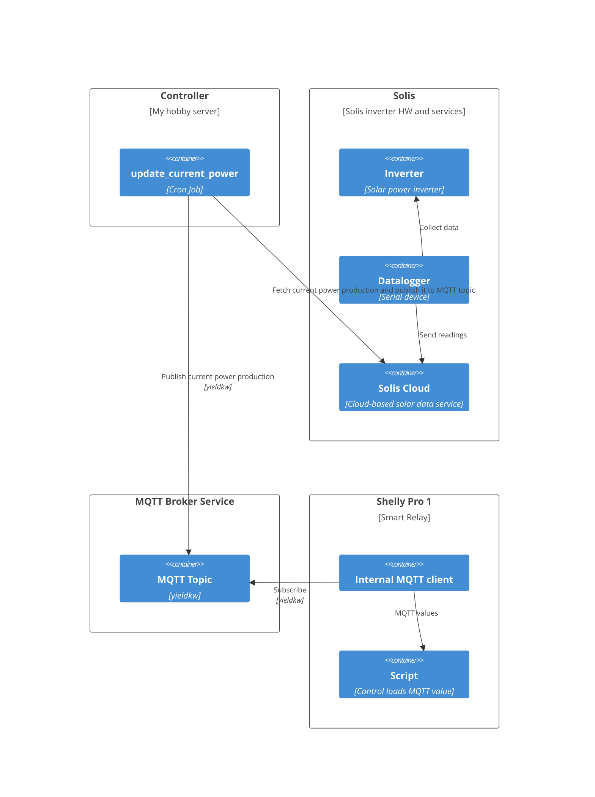

# solis-publisher

Get current power output from Solis API and publish it to an MQTT topic.

The Solis API is providing power station metrics from a Solis inverter
installed at a solar panel power station. The inverter is equipped with
a data logger that is collecting measurements from the inverter and storing
them in the Solis Cloud system. Data from the Solis Cloud can be read using
the Solis API with API keys associated to the registered owner of the data
logger.

## Intended operation

This module provides a command line tool that can be periodically run for
example as a cron job. The update interval should probably not be shorter
than 5 minutes.

## Use cases

* Turn loads on/off based on the amount of power generated
* Graph the energy yield over time (Solis Cloud already does this)
